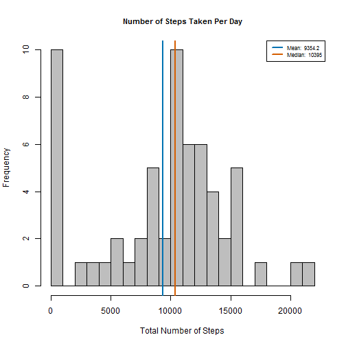
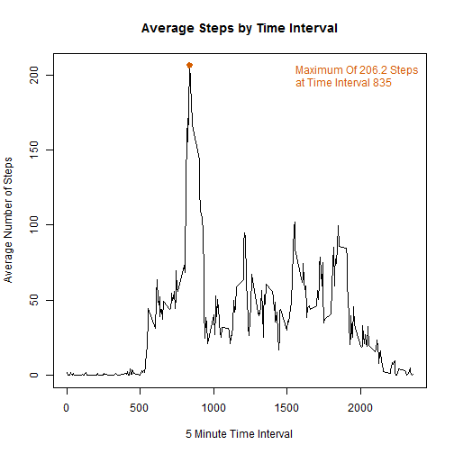
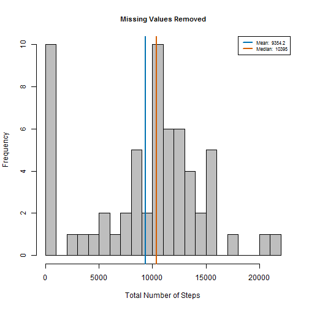
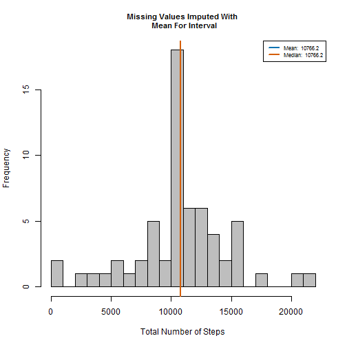
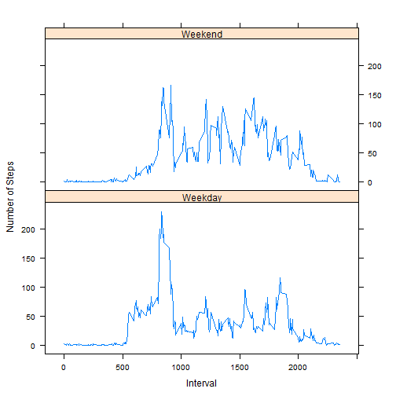

###Loading & Preprocessing Data

---

Show & Cleanup environment

```r
sessionInfo();
```

```
## R version 3.2.2 (2015-08-14)
## Platform: x86_64-w64-mingw32/x64 (64-bit)
## Running under: Windows 8 x64 (build 9200)
## 
## locale:
## [1] LC_COLLATE=English_United States.1252 
## [2] LC_CTYPE=English_United States.1252   
## [3] LC_MONETARY=English_United States.1252
## [4] LC_NUMERIC=C                          
## [5] LC_TIME=English_United States.1252    
## 
## attached base packages:
## [1] stats     graphics  grDevices utils     datasets  methods   base     
## 
## other attached packages:
## [1] lattice_0.20-33  knitr_1.11       data.table_1.9.6 ggplot2_1.0.1   
## 
## loaded via a namespace (and not attached):
##  [1] Rcpp_0.11.6      magrittr_1.5     MASS_7.3-43      munsell_0.4.2   
##  [5] colorspace_1.2-6 stringr_1.0.0    plyr_1.8.2       tools_3.2.2     
##  [9] grid_3.2.2       gtable_0.1.2     htmltools_0.2.6  yaml_2.1.13     
## [13] digest_0.6.8     reshape2_1.4.1   formatR_1.2.1    mime_0.4        
## [17] evaluate_0.8     rmarkdown_0.8.1  labeling_0.3     stringi_0.4-1   
## [21] scales_0.2.5     markdown_0.7.7   chron_2.3-47     proto_0.3-10
```

```r
rm(list=ls(all=TRUE)) 
```

Extract the dataset required for this assignment:

*This assignment makes use of data from a personal activity monitoring device. This device collects data at 5 minute intervals through out the day. The data consists of two months of data from an anonymous individual collected during the months of October and November, 2012 and include the number of steps taken in 5 minute intervals each day.*

The variables included in this dataset are:

1. **steps**: Number of steps taking in a 5-minute interval (missing values are coded as NA ) 
2. **date**: The date on which the measurement was taken in YYYY-MM-DD format 
3. **interval**: Identifier for the 5-minute interval in which measurement was taken

Read the data into a dataframe look at it...

```r
dataset = read.table('activity.csv', sep=",", header = T)
names(dataset)
```

```
## [1] "steps"    "date"     "interval"
```

```r
str(dataset)
```

```
## 'data.frame':	17568 obs. of  3 variables:
##  $ steps   : int  NA NA NA NA NA NA NA NA NA NA ...
##  $ date    : Factor w/ 61 levels "2012-10-01","2012-10-02",..: 1 1 1 1 1 1 1 1 1 1 ...
##  $ interval: int  0 5 10 15 20 25 30 35 40 45 ...
```

```r
head(dataset)
```

```
##   steps       date interval
## 1    NA 2012-10-01        0
## 2    NA 2012-10-01        5
## 3    NA 2012-10-01       10
## 4    NA 2012-10-01       15
## 5    NA 2012-10-01       20
## 6    NA 2012-10-01       25
```


###Histogram, Mean & Median

---

Make a histogram of the total number of steps taken each day:

```r
library(data.table)
tbl = data.table(dataset)
tbl_sum_day = tbl[, list(total_steps = sum(steps, na.rm = T)), by = date]
```

**Make The Histogram, And Report on Mean and Median:**

1.  Make a histogram of the total number of steps taken each day
2.  Calculate and report the mean and median total number of steps taken per day


```r
plot_hist = function(x, title){
  
        hist(x, breaks = 20,main = title, xlab = 'Total Number of Steps', col = 'grey', cex.main = .9)
        
        meanval = round(mean(x), 1)
        medianval = round(median(x), 1)
        
        abline(v=meanval, lwd = 2, col = "#0072B2")
        abline(v=medianval, lwd = 2, col = "#D55E00")
        
        legend('topright', lty = 1, lwd = 2, col = c("#0072B2", "#D55E00"),
               cex = .7, 
               legend = c(paste('Mean: ', meanval),
               paste('Median: ', medianval))
               )
}

plot_hist(tbl_sum_day$total_steps, 'Number of Steps Taken Per Day')
```

 


###Daily Activity Pattern

----------------------------

1.  Make a time series plot (i.e. type = "l") of the 5-minute interval (x-axis) and the average number of steps taken, averaged across all days (y-axis)
2.  Which 5-minute interval, on average across all the days in the dataset, contains the maximum number of steps?


```r
#summarize dataset by interval
tbl_sum_intv = tbl[, list(avg_steps = mean(steps, na.rm = T)), by = interval]

#plot the time series
with(tbl_sum_intv, {
  plot(interval, avg_steps, type = 'l',
     main = 'Average Steps by Time Interval',
     xlab = '5 Minute Time Interval',
     ylab = 'Average Number of Steps')
  })

max_steps = tbl_sum_intv[which.max(avg_steps), ]
max_lab = paste('Maximum Of ', round(max_steps$avg_steps, 1), ' Steps \nat Time Interval ', max_steps$interval, sep = '')
points(max_steps$interval,  max_steps$avg_steps, col = "#D55E00", lwd = 3, pch = 19)
legend("topright",legend = max_lab,text.col = "#D55E00",bty = 'n')
```

 

---

###Missing Values

1. Calculate & Report The Number of Missing Values

```r
sum(is.na(dataset$steps))
```

```
## [1] 2304
```

1. Devise a strategy for filling in all of the missing values in the dataset. The strategy does not need to be sophisticated. For example, you could use the mean/median for that day, or the mean for that 5-minute interval, etc.

2. Create a new dataset that is equal to the original dataset but with the missing data filled in.

```r
setkey(tbl, interval)
setkey(tbl_sum_intv, interval)

replaceMissing = function(x,y){
  if(is.na(x)){
    return(y)
  }
  return(x)
}

#create new dataset that imputes missing values by replacing NAs with average values
tbl_miss = tbl[tbl_sum_intv]
tbl_miss$imputed_steps = mapply(replaceMissing,tbl_miss$steps, tbl_miss$avg_steps)
tbl_sum_miss = tbl_miss[, list(imputed_steps = sum(imputed_steps, na.rm = T)), by = date]

#show
head(tbl_sum_miss)
```

```
##          date imputed_steps
## 1: 2012-10-01      10766.19
## 2: 2012-10-02        126.00
## 3: 2012-10-03      11352.00
## 4: 2012-10-04      12116.00
## 5: 2012-10-05      13294.00
## 6: 2012-10-06      15420.00
```

4.  Make a histogram of the total number of steps taken each day and Calculate and report the mean and median total number of steps taken per day. Do these values differ from the estimates from the first part of the assignment? What is the impact of imputing missing data on the estimates of the total daily number of steps?


```r
plot_hist(tbl_sum_day$total_steps, 'Missing Values Removed')
```

 

```r
plot_hist(tbl_sum_miss$imputed_steps, 'Missing Values Imputed With \n Mean For Interval')
```

 

**Answer to questions above:**
The mean and the median are now nearly the same after imputing missing values with the mean value for the interval. This seems to makes sense since the median value should now be closer to the mean. We see that the median value moves towards the mean.

###Are there differences in activity patterns between weekdays and weekends?

---
1.  Create a new factor variable in the dataset with two levels - "weekday" and "weekend" indicating whether a given date is a weekday or weekend day.

```r
partOfWeek = function(x){
  if(x %in% c('Saturday', 'Sunday')){
          return('Weekend')
  }
  
  return('Weekday')
}

tbl_miss$dayname = weekdays(as.Date(tbl_miss$date))
tbl_miss$daytype = as.factor(apply(as.matrix(tbl_miss$dayname), 1, partOfWeek))

#Group by interval and daytype
tbl_sum_miss = tbl_miss[, list(avg_steps = mean(imputed_steps, na.rm = T)), 
                          by = list(interval, daytype)]

str(tbl_sum_miss)
```

```
## Classes 'data.table' and 'data.frame':	576 obs. of  3 variables:
##  $ interval : int  0 0 5 5 10 10 15 15 20 20 ...
##  $ daytype  : Factor w/ 2 levels "Weekday","Weekend": 1 2 1 2 1 2 1 2 1 2 ...
##  $ avg_steps: num  2.2512 0.2146 0.4453 0.0425 0.1732 ...
##  - attr(*, ".internal.selfref")=<externalptr>
```

Panel plot:

```r
library(lattice)
xyplot(avg_steps~interval | daytype, data = tbl_sum_miss,
      type = 'l',
      xlab = 'Interval',
      ylab = 'Number of Steps',
      layout = c(1,2))
```

 
